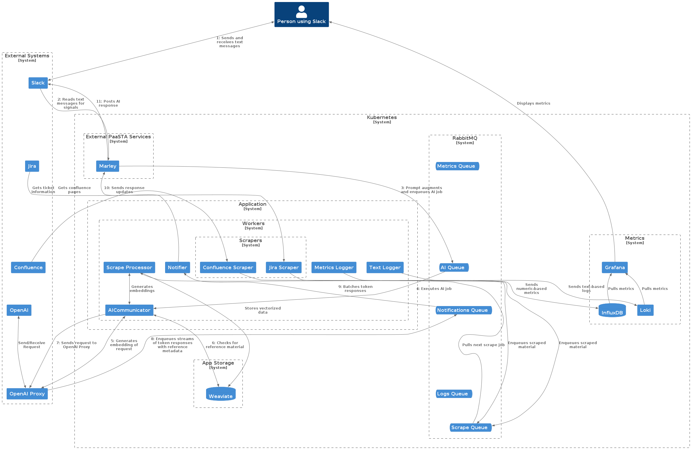

# REQUIRES
- docker
- kubectl
- k9s
- python
- make


# INSTALLATION

```
go install sigs.k8s.io/kind@v0.20.0
kind create cluster --name ailizabeth --config kind-cluster-config.yaml
kubectl cluster-info --context kind-ailizabeth
kubectl config set-context kind-ailizabeth
kubectl kustomize kustomize/ | kubectl apply -f -
```

# DELETION

```
kubectl kustomize kustomize/ | kubectl delete -f -
kind delete cluster ailizabeth
```


# PLANTUML



```
@startuml
!include <C4/C4_Container.puml>

LAYOUT_TOP_DOWN()
HIDE_STEREOTYPE()


Person(p1, "Person using Slack")

System_Boundary(external, "External Systems") {
  Container(slack, "Slack")
  Container(jira, "Jira")
  Container(conf, "Confluence")
  Container(openai, "OpenAI")
  Container(openaip, "OpenAI Proxy")  
}


System_Boundary(k8s, "Kubernetes") {

  System_Boundary(paasta, "External PaaSTA Services") {
    Container(marley, "Marley")
  }

  System_Boundary(app, "Application") {

    System_Boundary(workers, "Workers") {
      Container(qwmetr, "Metrics Logger")    
      Container(qwlogs, "Text Logger")    
      Container(qwnotif, "Notifier")    
      Container(qwai, "AICommunicator")    
      Container(qwscrape, "Scrape Processor")    

      System_Boundary(scrapers, "Scrapers") {
        Container(wsjira, "Jira Scraper")  
        Container(wsconf, "Confluence Scraper")  
      }
    }
  }

  System_Boundary(metrics, "Metrics") {
    Container(grafana, "Grafana")    
    Container(loki, "Loki")    
    ContainerDb(influxdb, "InfluxDB")    
  }

  System_Boundary(rmq, "RabbitMQ") {
    ContainerQueue(qmetr,"Metrics Queue")   
    ContainerQueue(qai,"AI Queue")   
    ContainerQueue(qnotif,"Notifications Queue")   
    ContainerQueue(qlogs,"Logs Queue")   
    ContainerQueue(qscrape,"Scrape Queue")   
  }
  
  System_Boundary(pers, "App Storage") {
    ContainerDb(weaviate, "Weaviate")
  }
}


Lay_D(paasta, app)
Lay_D(app, metrics)
Lay_D(metrics, rmq)
Lay_D(rmq, pers)

Lay_D(qmetr, qai)
Lay_D(qai, qnotif)
Lay_D(qnotif, qlogs)
Lay_D(qlogs, qscrape)

Lay_D(slack, jira)
Lay_D(jira, conf)
Lay_D(conf, openai)
Lay_D(openai, openaip)


BiRel(p1, slack, "1: Sends and receives text messages")
Rel(slack, marley, "2: Reads text messages for signals")
Rel(marley, qai, "3: Prompt augments and enqueues AI job")
Rel(qai, qwai, "4: Executes AI job")
BiRel(qwai, openaip, "5: Generates embedding of request")
BiRel(qwai, weaviate, "6: Checks for reference material")
Rel(qwai, openaip, "7: Sends request to OpenAI Proxy")
BiRel(openaip, openai, "Send/Receive Request")
Rel(openaip, qnotif, "8: Enqueues streams of token responses with reference metadata")
Rel(qnotif, qwnotif, "9: Batches token responses")
Rel(qwnotif, marley, "10: Sends response updates")
Rel(marley, slack, "11: Posts AI response")


Rel(qwlogs, loki, "Sends text-based logs")
Rel(qwmetr, influxdb, "Sends numeric-based metrics")
Rel_Back(grafana, loki, "Pulls metrics")
Rel_Back(grafana, influxdb, "Pulls metrics")
Rel(grafana, p1, "Displays metrics")

Rel(jira, wsjira, "Gets ticket information")
Rel(conf, wsconf, "Gets confluence pages")

Rel(wsjira, qscrape, "Enqueues scraped material")
Rel(wsconf, qscrape, "Enqueues scraped material")


Rel(qscrape, qwscrape, "Pulls next scrape job")
BiRel(qwscrape, qwai, "Generates embeddings")
Rel(qwscrape, weaviate, "Stores vectorized data")

@enduml
```
